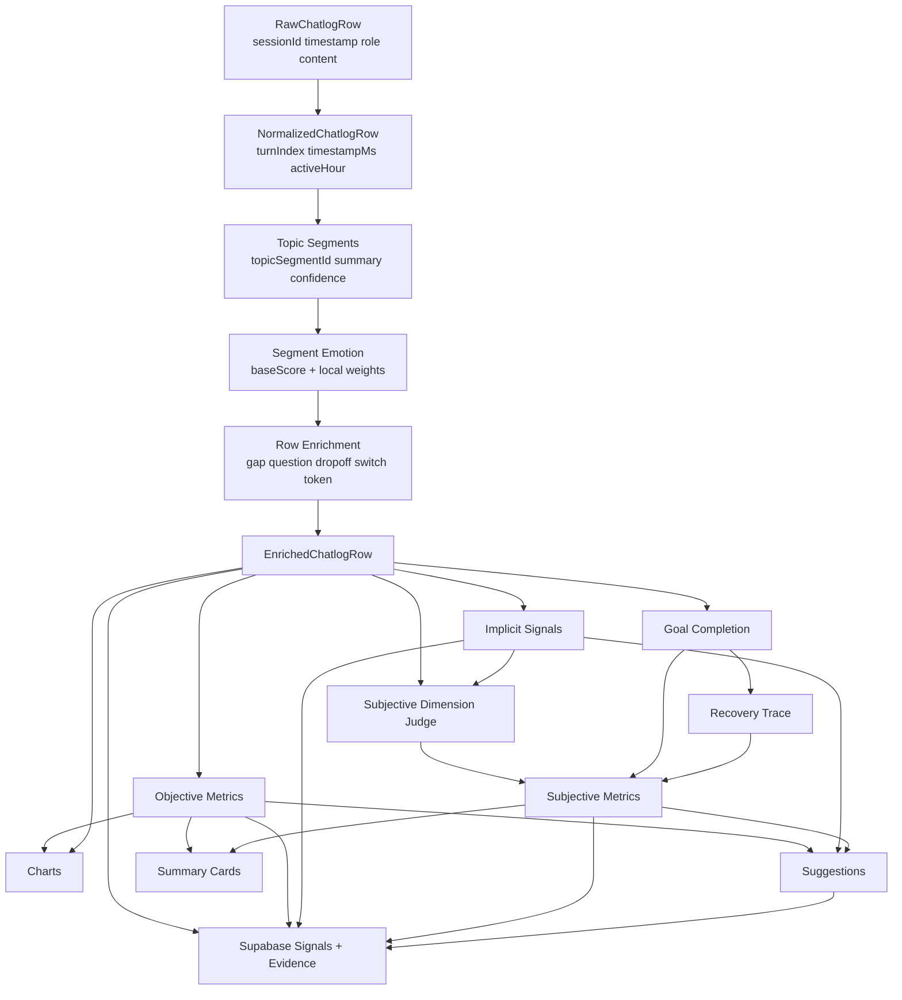
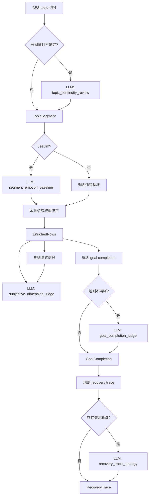

# 指标计算 DAG

> 推荐配套查看交互可视化版本：[`指标计算DAG.html`](./指标计算DAG.html)。该 HTML 用 Cytoscape + dagre 自动布局，节点全中文、按层着色，可切换 LLM 节点显隐与查看节点详情，渲染效果优于 Mermaid。

## 总览

## LLM 介入 DAG

## 输出落点

| 输出 | 目标 Supabase 表 |
| --- | --- |
| 评估运行元数据 | `evaluation_runs` |
| 对话消息 | `sessions`、`message_turns` |
| 主题片段 | `topic_segments` |
| 客观指标 | `objective_signals` |
| 隐式推断 | `risk_tags` |
| 主观指标 | `subjective_signals` |
| LLM 调用记录 | `judge_runs` |
| 证据片段 | `evidence_spans` |
| 优化建议 | `suggestions` |
| 图表与报告 | `report_artifacts` 或 `evaluation_runs.report_payload` |
