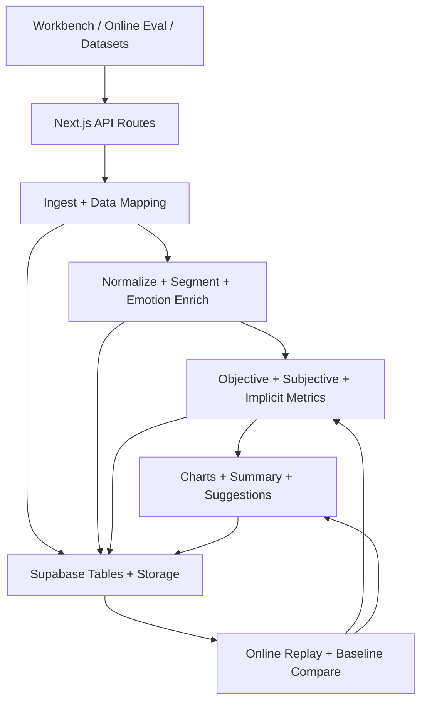

# 1-项目架构

## 重构目标

Zeval 的目标不是做一个大而全平台，而是把评估闭环做成稳定、透明、可迁移的产品内核。重构后仍保持 Next.js + TypeScript + App Router，但把当前散落在文件系统、兼容适配器和临时目录中的状态统一收敛到 Supabase/Postgres。

## 目标分层

| 层级 | 目标模块 | 职责 | 当前可参考代码 |
| --- | --- | --- | --- |
| 接入层 | upload / ingest / data-onboarding | 接收 CSV、JSON、TXT、MD，生成 canonical rawRows | `app/api/ingest/route.ts`、`src/parsers/*`、`src/data-onboarding/*` |
| 补全层 | normalizer / segmenter / emotion enrich | 排序、补 turn、topic 切分、情绪基准、行级派生字段 | `src/pipeline/enrich.ts`、`normalize.ts`、`segmenter.ts`、`emotion.ts` |
| 指标层 | objective / subjective / implicit | 计算客观指标、主观指标、隐式风险信号 | `src/pipeline/objectiveMetrics.ts`、`subjectiveMetrics.ts`、`signals.ts` |
| 证据层 | evidence / badcase / baseline | 保存证据片段、badcase、baseline、在线回放输入 | `src/pipeline/badCases.ts`、`src/workbench/*`、`src/eval-datasets/*` |
| 归因层 | capability classifier / failure-layer attributor / experiment router | 把 badcase 映射到能力维度与 harness 层；驱动对照实验路由（详见 [`15-能力维度评测与归因.md`](./15-能力维度评测与归因.md)） | 新增模块（P5），暂无现有代码 |
| 决策层 | copilot skills / optimization advisor | 用户痛点 → 能力定向 → 归因 → 优化路径推荐 | `src/copilot/skills.ts` 现有 6 个 skill，P5 新增 4 个决策 skill |
| 报告层 | charts / summary / suggestions | 生成图表、摘要卡、优化建议 | `src/pipeline/chartBuilder.ts`、`summary.ts`、`suggest.ts` |
| 存储层 | Supabase/Postgres | 所有业务对象、运行产物、指标信号、审计记录 | `supabase/migrations/*` 仅作参考，目标表以本方案重写 |

## 保留的核心功能

- 补全层：`RawChatlogRow -> NormalizedChatlogRow -> EnrichedChatlogRow` 的中间层思想保留。
- 主客观指标：客观指标稳定可算，主观指标由 LLM Judge 产出结构化 `score / reason / evidence / confidence`。
- 隐式推断：保留兴趣下降、理解障碍、情绪恢复失败等信号，但需要从“整表启发式”升级为可按 run/session/segment 追溯。
- baseline 和在线评测：保留“工作台生成 baseline -> 在线回放新模型/新 API -> 多指标对比”的闭环。
- 评测集：保留 goodcase/badcase、去重 hash、sample batch 抽样和回归验证能力。
- 能力维度切片：评测集主组织维度从"症状标签"升级为"能力维度"（12 个白名单），每条 case 必带 `capability_dimension`；badcase 必带 `failure_layer`（详见 [`15-能力维度评测与归因.md`](./15-能力维度评测与归因.md)）。

## 替换或删除的内容

| 当前内容 | 目标处理 |
| --- | --- |
| `local-json` 数据库适配 | 删除正式路径，仅可作为历史迁移输入，不进入新方案主链路 |
| filesystem dataset/workbench baseline/remediation stores | 改为 Supabase 表和对象存储；旧文件只做一次性迁移来源 |
| `workspaceId` 兼容语义 | 改为 `organization_id + project_id`，如需兼容旧 API，可在边界层做映射 |
| `zerore_records` 通用 JSONB 桥表 | 不作为目标态主表，只可作为迁移过渡或审计备份 |
| 页面内部逻辑说明 | 从用户界面移除，转入产品文档或运维文档 |

## 目标模块关系

## 重构后的工程原则

1. 计算函数保持纯函数优先，数据库写入集中在 route handler 或 service 层。
2. 每个评估运行必须先创建 `evaluation_runs`，再写入明细、指标和证据。
3. 每个主观指标必须记录 `judge_run_id`、prompt version、model、source、confidence。
4. 每个建议必须绑定触发指标和证据片段。
5. Scenario 不进入基础表强绑定，只通过 `scenario_contexts` 和 KPI 映射扩展。
