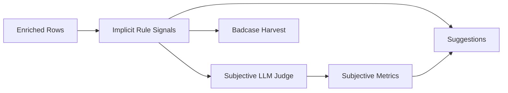

# 3-隐式推断

隐式推断用于把用户没有直接说出口的体验问题转成可观察风险信号。它不是 LLM 主观评审的替代品，而是 LLM Judge 的输入上下文、badcase 收获依据和建议触发条件。

## 目标信号

| 信号 | 当前含义 | 推荐粒度 | 主要输入 | 输出去向 |
| --- | --- | --- | --- | --- |
| `interestDeclineRisk` | 用户兴趣或参与度下降 | session + dataset 聚合 | 前后半段用户长度、响应间隔、提问率 | 主观 Judge、建议、badcase |
| `understandingBarrierRisk` | 用户理解障碍或 AI 未理解用户 | session + topic segment | 困惑表达、重复提问、问后切题失败 | 主观 Judge、答非所问风险 |
| `emotionRecoveryFailureRisk` | 负向情绪没有被恢复 | session + topic segment | 低情绪窗口、末轮断点、恢复分差 | 恢复轨迹、情绪建议 |

## 重构原则

1. 隐式推断必须保留规则可解释性，不直接交给 LLM 黑箱判断。
2. 每条信号必须保存触发规则、证据、置信度和作用范围。
3. 批量评估时不允许只输出全局一条信号，必须至少能回溯到 session。
4. LLM Judge 可以读取隐式信号，但不能覆盖原始规则证据。
5. 隐式信号进入 `risk_tags` 或 `implicit_signals` 类型表，并被 suggestions 引用。

## 计算口径

### 兴趣下降风险

输入：

- 前半段用户平均消息长度 `earlyAvgLength`
- 后半段用户平均消息长度 `lateAvgLength`
- 前后段平均响应间隔 `earlyAvgGap` / `lateAvgGap`
- 前后段用户提问率 `earlyQuestionRate` / `lateQuestionRate`

触发逻辑：

- 后段消息明显变短，表示投入下降。
- 后段间隔明显变长，表示回复意愿下降。
- 后段提问率下降，表示探索欲下降。

输出：

- `score`：0-1 或 0-100 风险分。
- `severity`：low / medium / high。
- `evidenceTurnRange`：触发窗口。
- `triggeredRules`：命中的规则列表。

### 理解障碍风险

输入：

- 困惑表达：如“没懂”“什么意思”“还是不清楚”。
- 重复问题：归一化问题重复出现。
- 问后切题失败：用户提问后 assistant 回复引发 topic switch。

输出用途：

- 给 `offTopicOrIgnoreRisk` 提供规则依据。
- 给建议生成“先复述用户目标，再回答”的触发条件。
- 给 badcase 打上 `understanding_barrier` 标签。

### 情绪恢复失败风险

输入：

- topic segment 情绪曲线。
- 低情绪轮次数量。
- 是否在低情绪后出现恢复分。
- 低情绪是否靠近断点或会话结束。

输出用途：

- 给 `emotionRecovery` 和 `recoveryTrace` 提供依据。
- 触发“先安抚再推进任务”的建议。
- 形成在线评测对比中的情绪恢复类指标。

## 与主观 Judge 的关系

## 数据库存储建议

目标态可使用统一 `risk_tags` 表，也可以拆出 `implicit_signals` 表。为了降低 MVP 重构复杂度，第一版建议使用统一信号表：

| 字段 | 说明 |
| --- | --- |
| `id` | 稳定 ID |
| `evaluation_run_id` | 所属评估运行 |
| `session_id` | 可为空；为空表示 dataset 级 |
| `topic_segment_id` | 可为空 |
| `signal_key` | 如 `interestDeclineRisk` |
| `score` | 风险分 |
| `severity` | low / medium / high |
| `reason` | 人类可读解释 |
| `triggered_rules` | JSONB 规则列表 |
| `evidence_span_id` | 证据片段 |
| `source` | 固定为 `inferred` 或 `rule` |
| `confidence` | 置信度 |

## 需要修正的现有问题

- 当前实现中部分隐式信号按整表计算，多 session 上传时语义容易混淆。
- 指标变量表中有若干中间变量未显式输出，导致用户难以复核。
- 风险信号与建议之间缺少稳定的触发映射表。
- 规则信号与 LLM 主观维度的来源边界需要在 DB 中显式记录。
