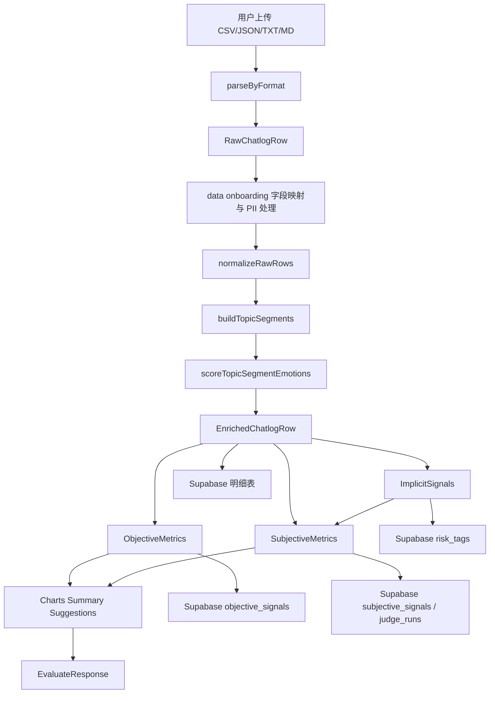
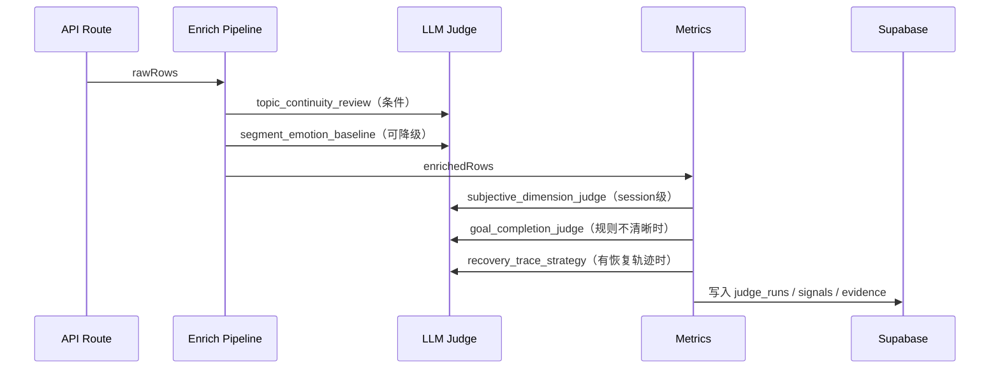

# 4-数据流转

本文档用于把 Zeval 的数据流从“黑盒评估结果”拆成可观察、可追踪的阶段。重构后的每个阶段都应有明确输入、输出、数据库落点和失败状态。

## 端到端主链路

## 阶段说明

| 阶段 | 输入 | 输出 | 失败/降级 |
| --- | --- | --- | --- |
| 文件解析 | 文件正文、格式 | `RawChatlogRow[]` | 返回可观测解析错误，不吞错 |
| 字段映射 | 原始列、mapping plan | canonical rawRows | LLM 映射失败时使用规则兜底，并输出 warning |
| PII 处理 | rawRows | redacted rawRows | 记录脱敏策略与统计 |
| 归一化 | rawRows | normalized rows | 缺时间时保留顺序，但 `hasTimestamp=false` |
| topic 切分 | normalized rows | topic segments | LLM 不可用时规则切分 |
| 情绪补全 | topic segments | segment emotion + row emotion | LLM 不可用时规则情绪分 |
| 客观指标 | enriched rows | objective metrics | 不依赖 LLM，必须成功 |
| 隐式信号 | enriched rows | risk signals | 规则输出，低置信度需标记 |
| 主观指标 | enriched rows + signals | subjective metrics | LLM 不可用时规则降级或标记不可用 |
| 报告组装 | metrics + rows | charts、summary、suggestions | 建议必须绑定触发指标 |

## 数据结构流转

| 数据结构 | 说明 | 目标落库 |
| --- | --- | --- |
| `RawChatlogRow` | 上传后的最小标准行 | `message_turns.raw_content` 或 import artifact |
| `NormalizedChatlogRow` | 补 turn、时间戳、排序后的行 | 不单独存表，可由 `message_turns` 字段表达 |
| `TopicSegment` | session 内主题片段 | `topic_segments` |
| `EnrichedChatlogRow` | 行级完整中间层 | `message_turns` + `turn_enrichments` 或 JSONB 扩展 |
| `ObjectiveMetrics` | 可复算统计指标 | `objective_signals` |
| `ImplicitSignal` | 规则推断风险 | `risk_tags` |
| `SubjectiveMetrics` | LLM/规则主观结果 | `subjective_signals`、`judge_runs` |
| `ChartPayload` | 前端图表数据 | `report_artifacts` 或 `evaluation_runs.report_payload` |
| `Suggestion` | 优化建议 | `suggestions` |

## LLM 介入时机

## Baseline 与在线评测流转

1. 工作台上传并完成评估。
2. 保存 baseline：写入 `baselines`，同时关联 `evaluation_runs`、`datasets`、`rawRows` 或 replay artifact。
3. 在线评测选择客户、baseline、回复 API。
4. 系统按 baseline 的用户侧消息回放，调用客户回复 API 生成 assistant turn。
5. 新会话重新走 evaluate pipeline。
6. 对比 baseline run 与 current run 的 objective、subjective、risk、suggestion 差异。

## 数据流转验收

- 任一前端图表都能追溯到对应 `evaluation_run_id` 和指标 key。
- 任一主观分数都能追溯到 prompt、model、证据片段和解析状态。
- 任一建议都能追溯到触发指标与影响说明。
- 任一 baseline 都能区分 `customer_id`、`baseline_run_id`、`created_at`、`source_run_id`。
